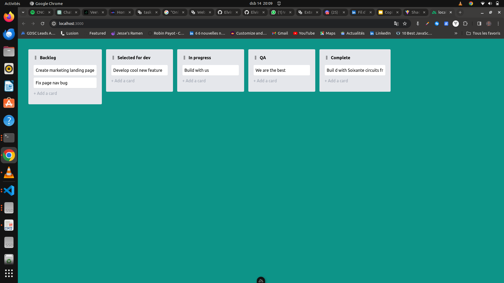

# Nuxt 3 Minimal Starter

Bienvenue dans le projet de Trello-board, une interface drag and drop ressemblant à Trello en utilisant la puissance du framework Nuxt.js.

Plus de détails ici:  [Nuxt 3 documentation](https://nuxt.com/docs/getting-started/introduction) to learn more.

## Aperçu



## Setup

Make sure to install the dependencies:

```bash
# npm
npm install

# pnpm
pnpm install

# yarn
yarn install
```

## Development Server

Start the development server on `http://localhost:3000`:

```bash
# npm
npm run dev

# pnpm
pnpm run dev

# yarn
yarn dev
```

## Production

Build the application for production:

```bash
# npm
npm run build

# pnpm
pnpm run build

# yarn
yarn build
```

Locally preview production build:

```bash
# npm
npm run preview

# pnpm
pnpm run preview

# yarn
yarn preview
```

Check out the [deployment documentation](https://nuxt.com/docs/getting-started/deployment) for more information.
